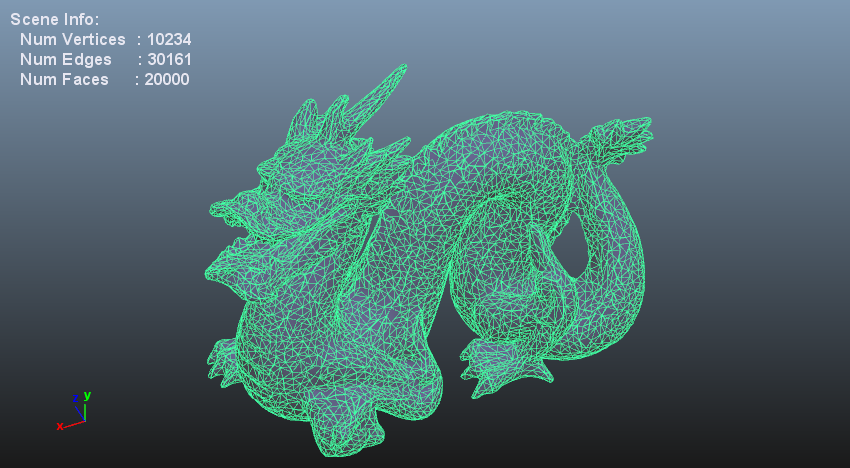

Simple Development Framework for 3D Mesh Viewer. (C++)
====

This package provides a simple framework to develop a 3D mesh viewer with C++ on Windows.
The framework is in active development, and
I plan to focus on exploring a better development scheme for mesh analysis functions.

### GUI Features
#### Main Window
Main window provides a simple 3D mesh viewer and menus.

* **Camera Control**
    - **Rotate**: Alt + Left Drag.
    - **Move**: Alt + Middle Drag.
    - **Zoom**: Mouse Wheel.


#### Menus.
* **File**: read and write 3D mesh file.
    - **Load 3D Mesh File**: supported files (`*.obj, *.ply, *.off`, etc.).
    - **Save 3D Mesh File**: supported files (`*.obj, *.ply, *.off`, etc.).
* **Operations**: edit 3D mesh.
    - **Noise**: add noise to the mesh.
       
    - **Laplacian Smooting**: smooth the mesh via Laplacian smoothing.
        
* **Coloring**: visualize a 3D mesh feature with computed vertex or face colors (updated on command).
    - **Normal Color**: show normal colors.
       
    - **Position Color**: show position colors.
* **Shader**: visualize a 3D mesh with GLSL shaders (interactive updates).
    - **Normal Shader**: shading with normal colors.
    - **Toon Shader**: visualize mesh with toon shading.
       
* **Overlay**: switch the overlay modes.
    - **Show Wireframe**: show wireframe.
       
    - **Show Points**: show points.
       
    - **Show Normals**: show normal vectors.
       

### Dependencies.
For CMake build process:

* [Qt](http://www.qt.io/) (version 5.2.1 or higher)
    - Qt is used for developing the main GUI and OpenGL rendering functions.
    - CMake will automatically detect Qt directory.
* [Eigen](http://eigen.tuxfamily.org/index.php?title=Main_Page) (version 3.1 or higher)
    - Eigen is used for scene data representations.
    - Recommended to locate Eigen directory in `$ENV{EXT_LIB_ROOT}/Eigen/${EIGEN_VERSION}`.
* [OpenMesh](http://www.openmesh.org/) (version 3.0 or higher)
    - OpenMesh is used for mesh structure and io.
    - Recommended to locate OpenMesh directory in `$ENV{EXT_LIB_ROOT}/OpenMesh/${OPENMESH_VERSION}`.

#### 1.External libraries.
Please check the external library locations:

* Eigen: [`cmake/FindEigen.cmake`](cmake/FindEigen.cmake)
    - *Note*: Assume `"$ENV{EXT_LIB_ROOT}/Eigen/${EIGEN_VERSION}"` for the installation path.
* OpenMesh: [`cmake/FindOpenMesh.cmake`](cmake/FindOpenMesh.cmake)
    - *Note*: Assume `"$ENV{EXT_LIB_ROOT}/OpenMesh/${OPENMESH_VERSION}"` for the installation path.

The directory structure for each library (e.g. OpenMesh 4.1):

* `"$ENV{EXT_LIB_ROOT}/OpenMesh/4.1"`: Package location.
    - `include`: Include directory.
    - `lib`: Library directory.
        - `x86`: 32-bit .lib .dll file.
        - `x64`: 64-bit .lib .dll file.


#### 2.Generate a Visual Studio solution with the following command.

``` bash
  # See also cmake_generate.bat
  > cd build
  > cmake .. -G "Visual Studio 11 Win64"
  > cd ..
```

You can specify a version and target platform with **-G** (generator) option.

|Product name  |Version number | Target platform | Generator option |
|--------------|---------------|-----------------|-----------------|
|Visual Studio 2008| 9.0       | 32-bit     | "Visual Studio 9" |
|Visual Studio 2008| 9.0       | 64-bit     | "Visual Studio 9 Win64"|
|Visual Studio 2010| 10.0       | 32-bit     | "Visual Studio 10" |
|Visual Studio 2010| 10.0       | 64-bit     | "Visual Studio 10 Win64"|
|Visual Studio 2012| 11.0       | 32-bit     | "Visual Studio 11" |
|Visual Studio 2012| 11.0       | 64-bit     | "Visual Studio 11 Win64"|
|Visual Studio 2013| 12.0       | 32-bit     | "Visual Studio 12" |
|Visual Studio 2013| 12.0       | 64-bit     | "Visual Studio 12 Win64"|

Please also check the Visual Studio version used in your Maya.
Using the same version is highly recommended for stable running.

|Maya version |Visual Studio version |
|--------------|---------------|
|Maya2011      | "Visual Studio 9"|
|Maya2012      | "Visual Studio 9"|
|Maya2013      | "Visual Studio 10"|
|Maya2014      | "Visual Studio 10|
|Maya2015      | "Visual Studio 11"|
|Maya2016      | "Visual Studio 11"|

#### 3.Build the application with the following command.

``` bash
  # See also cmake_build.bat
  > cmake --build ./build --config Release
```

## License

The MIT License 2015 (c) tody